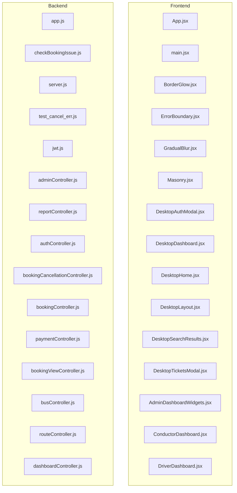

# EnteKsrtc Project Architecture Map

## 1. PROJECT OVERVIEW
- **Frontend**: React (based on finding components/hooks in frontend/src)
- **Backend**: Node.js/Express (based on backend/)
- **Database**: MongoDB (Mongoose)

## 2. FRONTEND FILE CONNECTIONS

**frontend/vite.config.js**
- imports -> `vite`
- imports -> `@vitejs/plugin-react`

**frontend/src/App.jsx**
- imports -> `react`
- imports -> `react-router-dom`
- imports -> `lucide-react`
- imports -> `./store/useAuthStore`
- imports -> `./store/useAppStore`
- imports -> `./services/authService`
- imports -> `./components/desktop/DesktopLayout`
- imports -> `./components/mobile/MobileLayout`

**frontend/src/main.jsx**
- imports -> `react`
- imports -> `react-dom/client`
- imports -> `react-router-dom`
- imports -> `./App.jsx`
- imports -> `./context/ThemeContext.jsx`

**frontend/src/components/BorderGlow.jsx**
- imports -> `react`

**frontend/src/components/ErrorBoundary.jsx**
- imports -> `react`

**frontend/src/components/GradualBlur.jsx**
- imports -> `react`

**frontend/src/components/Masonry.jsx**
- imports -> `react`
- imports -> `gsap`

**frontend/src/components/desktop/DesktopAuthModal.jsx**
- imports -> `react`
- imports -> `lucide-react`
- imports -> `../../hooks/useAuthForm`

**frontend/src/components/desktop/DesktopDashboard.jsx**
- imports -> `react`
- imports -> `../../store/useAuthStore`
- imports -> `../../hooks/useDashboardData`
- imports -> `../../utils/roleUtils`
- imports -> `./dashboards/AdminDashboardWidgets`
- imports -> `./dashboards/PassengerDashboardWidgets`
- imports -> `./dashboards/StationMasterDashboard`
- imports -> `./dashboards/ConductorDashboard`
- imports -> `./dashboards/DriverDashboard`
- imports -> `./dashboards/SupportDashboard`
- imports -> `./dashboards/SettingsView`
- imports -> `../ErrorBoundary`

**frontend/src/components/desktop/DesktopHome.jsx**
- imports -> `react`
- imports -> `react-router-dom`
- imports -> `../../store/useAuthStore`
- imports -> `../../store/useAppStore`
- imports -> `../../store/useBookingStore`
- imports -> `../../context/ThemeContext`
- imports -> `../../services/authService`
- imports -> `../../hooks/useAppLogic`
- imports -> `../home/GallerySection`
- imports -> `../home/TestimonialsSection`
- imports -> `../home/Marquee`
- imports -> `../../data/mockData`
- imports -> `../shared/StopSearchAutocomplete`

**frontend/src/components/desktop/DesktopLayout.jsx**
- imports -> `react`
- imports -> `react-router-dom`
- imports -> `../../store/useAuthStore`
- imports -> `../../store/useBookingStore`
- imports -> `../../context/ThemeContext`
- imports -> `../../store/useAppStore`
- imports -> `../../hooks/useAppLogic`
- imports -> `../../services/authService`
- imports -> `./DesktopHome`
- imports -> `./DesktopSearchResults`
- imports -> `./DesktopAuthModal`
- imports -> `./DesktopDashboard`
- imports -> `./DesktopTicketsModal`
- imports -> `../../data/mockData`

**frontend/src/components/desktop/DesktopSearchResults.jsx**
- imports -> `react`
- imports -> `react-router-dom`
- imports -> `lucide-react`
- imports -> `../../hooks/useBusSearch`
- imports -> `../../hooks/useSeatGrid`
- imports -> `../shared/SeatGrid`
- imports -> `../shared/StopSearchAutocomplete`
- imports -> `../../store/useBookingStore`
- imports -> `../../utils/pdfUtils.jsx`
- imports -> `../../store/useAuthStore`

**frontend/src/components/desktop/DesktopTicketsModal.jsx**
- imports -> `react`
- imports -> `lucide-react`
- imports -> `../../utils/pdfUtils.jsx`
- imports -> `../../store/useAuthStore`

**frontend/src/components/desktop/dashboards/AdminDashboardWidgets.jsx**
- imports -> `react`
- imports -> `lucide-react`

**frontend/src/components/desktop/dashboards/ConductorDashboard.jsx**
- imports -> `react`

**frontend/src/components/desktop/dashboards/DriverDashboard.jsx**
- imports -> `react`
- imports -> `lucide-react`

**frontend/src/components/desktop/dashboards/PassengerDashboardWidgets.jsx**
- imports -> `react`
- imports -> `lucide-react`
- imports -> `react-router-dom`
- imports -> `../../../utils/bookingAdapter`
- imports -> `../../../store/useBookingStore`
- imports -> `../../shared/StopSearchAutocomplete`
- imports -> `../../../utils/pdfUtils.jsx`
- imports -> `../../../services/bookingService`

**frontend/src/components/desktop/dashboards/SettingsView.jsx**
- imports -> `react`
- imports -> `lucide-react`
- imports -> `../../../store/useAuthStore`
- imports -> `../../../context/ThemeContext`
- imports -> `../../../services/authService`

**frontend/src/components/desktop/dashboards/StationMasterDashboard.jsx**
- imports -> `react`

**frontend/src/components/desktop/dashboards/SupportDashboard.jsx**
- imports -> `react`

**frontend/src/components/home/DestinationsSection.jsx**
- imports -> `react`

**frontend/src/components/home/GallerySection.jsx**
- imports -> `react`
- imports -> `../Masonry`
- imports -> `../BorderGlow`

**frontend/src/components/home/LazyLoad.jsx**
- imports -> `react`

**frontend/src/components/home/Marquee.jsx**
- imports -> `react`

**frontend/src/components/home/TestimonialsSection.jsx**
- imports -> `react`
- imports -> `lucide-react`

**frontend/src/components/home/TopRoutesSection.jsx**
- imports -> `react`
- imports -> `lucide-react`

**frontend/src/components/mobile/MobileAppHeader.jsx**
- imports -> `react`
- imports -> `lucide-react`

**frontend/src/components/mobile/MobileBookingWidget.jsx**
- imports -> `react`
- imports -> `lucide-react`
- imports -> `../shared/StopSearchAutocomplete`

**frontend/src/components/mobile/MobileDashboard.jsx**
- imports -> `react`
- imports -> `lucide-react`
- imports -> `../../store/useAuthStore`
- imports -> `../../hooks/useDashboardData`
- imports -> `./MobilePassengerDashboardWidgets`
- imports -> `../desktop/dashboards/AdminDashboardWidgets`
- imports -> `../desktop/dashboards/StationMasterDashboard`
- imports -> `../desktop/dashboards/ConductorDashboard`
- imports -> `../desktop/dashboards/DriverDashboard`
- imports -> `../desktop/dashboards/SupportDashboard`
- imports -> `../../utils/roleUtils`

**frontend/src/components/mobile/MobileHomeTab.jsx**
- imports -> `react`
- imports -> `lucide-react`
- imports -> `./MobileBookingWidget`
- imports -> `../GradualBlur`
- imports -> `../home/Marquee`

**frontend/src/components/mobile/MobileLayout.jsx**
- imports -> `react`
- imports -> `react-router-dom`
- imports -> `../../store/useAuthStore`
- imports -> `../../store/useAppStore`
- imports -> `../../store/useBookingStore`
- imports -> `../../context/ThemeContext`
- imports -> `../../services/authService`
- imports -> `../../hooks/useAppLogic`
- imports -> `./MobileAppHeader`
- imports -> `./MobileLiveTracking`
- imports -> `./MobileTimings`
- imports -> `./MobileSearchResults`
- imports -> `./MobileTicketsTab`
- imports -> `./MobileDashboard`
- imports -> `./MobileHomeTab`
- imports -> `./MobileLoginModal`
- imports -> `lucide-react`
- imports -> `../../data/mockData`
- imports -> `../home/TopRoutesSection`
- imports -> `../home/DestinationsSection`
- imports -> `../home/GallerySection`
- imports -> `../home/TestimonialsSection`

**frontend/src/components/mobile/MobileLiveTracking.jsx**
- imports -> `react`
- imports -> `lucide-react`

**frontend/src/components/mobile/MobileLoginModal.jsx**
- imports -> `react`
- imports -> `lucide-react`
- imports -> `../../hooks/useAuthForm`

**frontend/src/components/mobile/MobilePassengerDashboardWidgets.jsx**
- imports -> `react`
- imports -> `lucide-react`

**frontend/src/components/mobile/MobileSearchResults.jsx**
- imports -> `react`
- imports -> `react-router-dom`
- imports -> `lucide-react`
- imports -> `./MobileBookingWidget`
- imports -> `../../hooks/useBusSearch`
- imports -> `../../hooks/useSeatGrid`
- imports -> `../../context/ThemeContext`
- imports -> `../shared/SeatGrid`
- imports -> `../../utils/pdfUtils.jsx`
- imports -> `../../store/useAuthStore`

**frontend/src/components/mobile/MobileTicketsTab.jsx**
- imports -> `react`
- imports -> `lucide-react`
- imports -> `../../utils/pdfUtils.jsx`
- imports -> `../../store/useAuthStore`

**frontend/src/components/mobile/MobileTimings.jsx**
- imports -> `react`
- imports -> `lucide-react`

**frontend/src/components/shared/PrintableTicket.jsx**
- imports -> `react`
- imports -> `lucide-react`

**frontend/src/components/shared/SeatGrid.jsx**
- imports -> `react`
- imports -> `lucide-react`

**frontend/src/components/shared/StopSearchAutocomplete.jsx**
- imports -> `react`
- imports -> `../../services/apiClient`

**frontend/src/context/ThemeContext.jsx**
- imports -> `react`

**frontend/src/hooks/useAppLogic.js**
- imports -> `react`
- imports -> `../store/useBookingStore`
- imports -> `../store/useAuthStore`
- imports -> `react-router-dom`

**frontend/src/hooks/useAuthForm.js**
- imports -> `react`
- imports -> `../services/authService`
- imports -> `../services/firebaseAuth`

**frontend/src/hooks/useBusBookingFlow.js**
- imports -> `react`
- imports -> `../services/busService`
- imports -> `../services/busService`

**frontend/src/hooks/useBusSearch.js**
- imports -> `react`
- imports -> `../services/busService`

**frontend/src/hooks/useDashboardData.js**
- imports -> `react`
- imports -> `../services/dashboardService`

**frontend/src/hooks/useSeatGrid.js**
- imports -> `react`
- imports -> `../services/busService`

**frontend/src/services/apiClient.js**
- imports -> `axios`

**frontend/src/services/authService.js**
- imports -> `./apiClient`

**frontend/src/services/bookingService.js**
- imports -> `./apiClient`

**frontend/src/services/busService.js**
- imports -> `./apiClient`

**frontend/src/services/dashboardService.js**
- imports -> `./apiClient`

**frontend/src/services/firebaseAuth.js**
- imports -> `firebase/auth`
- imports -> `firebase/app`

**frontend/src/store/useAppStore.js**
- imports -> `zustand`

**frontend/src/store/useAuthStore.js**
- imports -> `zustand`

**frontend/src/store/useBookingStore.js**
- imports -> `zustand`

**frontend/src/utils/pdfUtils.jsx**
- imports -> `react`
- imports -> `react-dom/client`
- imports -> `jspdf`
- imports -> `html2canvas`
- imports -> `../components/shared/PrintableTicket`

## 3. BACKEND FILE CONNECTIONS

**backend/app.js**
- requires/imports -> `express`
- requires/imports -> `cors`
- requires/imports -> `helmet`
- requires/imports -> `morgan`
- requires/imports -> `cookie-parser`
- requires/imports -> `./middleware/notFoundMiddleware.js`
- requires/imports -> `./middleware/errorMiddleware.js`
- requires/imports -> `./routes/authRoutes.js`
- requires/imports -> `./routes/userRoutes.js`
- requires/imports -> `./routes/dashboardRoutes.js`
- requires/imports -> `./routes/tripRoutes.js`
- requires/imports -> `./routes/bookingRoutes.js`
- requires/imports -> `./routes/stopRoutes.js`
- requires/imports -> `./routes/adminRoutes.js`

**backend/checkBookingIssue.js**
- requires/imports -> `mongoose`
- requires/imports -> `dotenv`
- requires/imports -> `./database/models/Booking.js`
- requires/imports -> `./database/models/BookingSeat.js`

**backend/server.js**
- requires/imports -> `dns`
- requires/imports -> `dotenv`
- requires/imports -> `./app.js`
- requires/imports -> `./database/db.js`
- requires/imports -> `./controllers/booking/bookingController.js`
- requires/imports -> `./services/paymentService.js`

**backend/test_cancel_err.js**
- requires/imports -> `mongoose`
- requires/imports -> `dotenv`
- requires/imports -> `./database/models/Booking.js`
- requires/imports -> `./database/models/Trip.js`
- requires/imports -> `./utils/cancellationPolicy.js`

**backend/controllers/admin/adminController.js**
- requires/imports -> `../../database/models/Booking.js`
- requires/imports -> `../../database/models/User.js`
- requires/imports -> `../../database/models/Bus.js`

**backend/controllers/auth/authController.js**
- requires/imports -> `../../services/firebaseAdmin.js`

**backend/controllers/booking/bookingCancellationController.js**
- requires/imports -> `../../database/models/Booking.js`
- requires/imports -> `../../database/models/Payment.js`
- requires/imports -> `../../utils/auditUtils.js`
- requires/imports -> `../../utils/cancellationPolicy.js`
- requires/imports -> `../../services/paymentService.js`

**backend/controllers/booking/bookingController.js**
- requires/imports -> `../../database/models/Booking.js`
- requires/imports -> `../../database/models/BookingSeat.js`
- requires/imports -> `../../database/models/Trip.js`
- requires/imports -> `../../database/models/RouteStop.js`
- requires/imports -> `../../database/models/Payment.js`
- requires/imports -> `../../database/models/Ticket.js`
- requires/imports -> `../../utils/fareUtils.js`
- requires/imports -> `../../utils/auditUtils.js`
- requires/imports -> `../../utils/cancellationPolicy.js`
- requires/imports -> `../../services/notificationService.js`
- requires/imports -> `mongoose`
- requires/imports -> `crypto`

**backend/controllers/booking/views/bookingViewController.js**
- requires/imports -> `../../../database/models/Booking.js`
- requires/imports -> `../../../database/models/BookingSeat.js`

**backend/controllers/dashboard/dashboardController.js**
- requires/imports -> `../../database/models/Booking.js`
- requires/imports -> `../../database/models/Trip.js`
- requires/imports -> `../../database/models/Route.js`
- requires/imports -> `../../database/models/Bus.js`
- requires/imports -> `../../database/models/Stop.js`
- requires/imports -> `../../database/models/User.js`
- requires/imports -> `../../database/models/Depot.js`
- requires/imports -> `../../utils/roleUtils.js`

**backend/controllers/station/stopController.js**
- requires/imports -> `../../database/models/Stop.js`

**backend/controllers/trip/adminInventoryController.js**
- requires/imports -> `../../database/models/Trip.js`
- requires/imports -> `../../database/models/Booking.js`
- requires/imports -> `../../database/models/BookingSeat.js`
- requires/imports -> `../../database/models/BusLayout.js`
- requires/imports -> `../../utils/auditUtils.js`
- requires/imports -> `crypto`

**backend/controllers/trip/recurringScheduleController.js**
- requires/imports -> `../../database/models/RecurringSchedule.js`

**backend/controllers/trip/timetableController.js**
- requires/imports -> `../../database/models/Trip.js`
- requires/imports -> `../../database/models/TripStop.js`
- requires/imports -> `../../database/models/RouteStop.js`
- requires/imports -> `../../utils/auditUtils.js`

**backend/controllers/trip/tripController.js**
- requires/imports -> `../../database/models/Trip.js`
- requires/imports -> `../../database/models/TripStop.js`
- requires/imports -> `../../database/models/RouteStop.js`
- requires/imports -> `../../database/models/Stop.js`
- requires/imports -> `../../database/models/Booking.js`
- requires/imports -> `../../database/models/BookingSeat.js`
- requires/imports -> `../../database/models/BusLayout.js`
- requires/imports -> `../../utils/fareUtils.js`
- requires/imports -> `../../utils/scheduleMaterializer.js`

**backend/database/db.js**
- requires/imports -> `mongoose`

**backend/database/models/AuditLog.js**
- requires/imports -> `mongoose`

**backend/database/models/Booking.js**
- requires/imports -> `mongoose`

**backend/database/models/BookingAudit.js**
- requires/imports -> `mongoose`

**backend/database/models/BookingSeat.js**
- requires/imports -> `mongoose`

**backend/database/models/Bus.js**
- requires/imports -> `mongoose`

**backend/database/models/BusLayout.js**
- requires/imports -> `mongoose`

**backend/database/models/Depot.js**
- requires/imports -> `mongoose`

**backend/database/models/Notification.js**
- requires/imports -> `mongoose`

**backend/database/models/Payment.js**
- requires/imports -> `mongoose`

**backend/database/models/RecurringSchedule.js**
- requires/imports -> `mongoose`

**backend/database/models/Review.js**
- requires/imports -> `mongoose`

**backend/database/models/Role.js**
- requires/imports -> `mongoose`

**backend/database/models/Route.js**
- requires/imports -> `mongoose`

**backend/database/models/RouteStop.js**
- requires/imports -> `mongoose`

**backend/database/models/SeatAvailability.js**
- requires/imports -> `mongoose`

**backend/database/models/Stop.js**
- requires/imports -> `mongoose`

**backend/database/models/SystemSetting.js**
- requires/imports -> `mongoose`

**backend/database/models/Ticket.js**
- requires/imports -> `mongoose`

**backend/database/models/Trip.js**
- requires/imports -> `mongoose`

**backend/database/models/TripStop.js**
- requires/imports -> `mongoose`

**backend/database/models/User.js**
- requires/imports -> `mongoose`
- requires/imports -> `bcrypt`

**backend/middleware/authMiddleware.js**
- requires/imports -> `jsonwebtoken`
- requires/imports -> `../database/models/User.js`

**backend/middleware/validateRequest.js**
- requires/imports -> `zod`

**backend/routes/adminRoutes.js**
- requires/imports -> `express`
- requires/imports -> `../controllers/admin/adminController.js`
- requires/imports -> `../middleware/authMiddleware.js`

**backend/routes/authRoutes.js**
- requires/imports -> `express`
- requires/imports -> `express-rate-limit`
- requires/imports -> `../controllers/auth/authController.js`
- requires/imports -> `../middleware/authMiddleware.js`
- requires/imports -> `../middleware/validateRequest.js`
- requires/imports -> `../validators/authValidators.js`

**backend/routes/bookingRoutes.js**
- requires/imports -> `express`
- requires/imports -> `../controllers/booking/bookingCancellationController.js`
- requires/imports -> `../middleware/authMiddleware.js`

**backend/routes/dashboardRoutes.js**
- requires/imports -> `express`
- requires/imports -> `../controllers/dashboard/dashboardController.js`
- requires/imports -> `../middleware/authMiddleware.js`

**backend/routes/stopRoutes.js**
- requires/imports -> `express`
- requires/imports -> `../controllers/station/stopController.js`

**backend/routes/tripRoutes.js**
- requires/imports -> `express`
- requires/imports -> `../controllers/trip/tripController.js`
- requires/imports -> `../controllers/trip/adminInventoryController.js`
- requires/imports -> `../controllers/trip/timetableController.js`
- requires/imports -> `../controllers/trip/recurringScheduleController.js`
- requires/imports -> `../middleware/authMiddleware.js`

**backend/routes/userRoutes.js**
- requires/imports -> `express`
- requires/imports -> `../middleware/authMiddleware.js`

**backend/scripts/mass_seeder.js**
- requires/imports -> `dns`
- requires/imports -> `mongoose`
- requires/imports -> `dotenv`
- requires/imports -> `./database/models/Stop.js`
- requires/imports -> `./database/models/Depot.js`
- requires/imports -> `./database/models/Bus.js`
- requires/imports -> `./database/models/Route.js`
- requires/imports -> `./database/models/RouteStop.js`
- requires/imports -> `./database/models/Trip.js`
- requires/imports -> `./database/models/TripStop.js`
- requires/imports -> `path`
- requires/imports -> `url`

**backend/scripts/reset_admin.js**
- requires/imports -> `mongoose`
- requires/imports -> `bcrypt`
- requires/imports -> `dotenv`

**backend/scripts/reset_user.js**
- requires/imports -> `mongoose`
- requires/imports -> `bcrypt`
- requires/imports -> `dotenv`

**backend/scripts/test_payment.js**
- requires/imports -> `crypto`

**backend/scripts/validate_db.js**
- requires/imports -> `mongoose`
- requires/imports -> `file:///C:/Users/HP/Desktop/B-tech/S5/AWT/project/EnteKsrtc/backend/database/models/Depot.js`
- requires/imports -> `file:///C:/Users/HP/Desktop/B-tech/S5/AWT/project/EnteKsrtc/backend/database/models/Bus.js`
- requires/imports -> `file:///C:/Users/HP/Desktop/B-tech/S5/AWT/project/EnteKsrtc/backend/database/models/Route.js`
- requires/imports -> `file:///C:/Users/HP/Desktop/B-tech/S5/AWT/project/EnteKsrtc/backend/database/models/RouteStop.js`
- requires/imports -> `file:///C:/Users/HP/Desktop/B-tech/S5/AWT/project/EnteKsrtc/backend/database/models/Stop.js`
- requires/imports -> `file:///C:/Users/HP/Desktop/B-tech/S5/AWT/project/EnteKsrtc/backend/database/models/Trip.js`
- requires/imports -> `file:///C:/Users/HP/Desktop/B-tech/S5/AWT/project/EnteKsrtc/backend/database/models/TripStop.js`

**backend/services/authService.js**
- requires/imports -> `jsonwebtoken`
- requires/imports -> `../database/models/User.js`
- requires/imports -> `./firebaseAdmin.js`
- requires/imports -> `../middleware/authMiddleware.js`

**backend/services/firebaseAdmin.js**
- requires/imports -> `firebase-admin/app`
- requires/imports -> `firebase-admin/auth`

**backend/services/notificationService.js**
- requires/imports -> `../database/models/Notification.js`
- requires/imports -> `./notificationProviders/simulatedEmailProvider.js`
- requires/imports -> `./notificationProviders/simulatedSmsProvider.js`
- requires/imports -> `./notificationProviders/simulatedWhatsAppProvider.js`

**backend/services/paymentService.js**
- requires/imports -> `crypto`
- requires/imports -> `dotenv`

**backend/services/notificationProviders/simulatedEmailProvider.js**
- requires/imports -> `crypto`

**backend/services/notificationProviders/simulatedSmsProvider.js**
- requires/imports -> `crypto`

**backend/services/notificationProviders/simulatedWhatsAppProvider.js**
- requires/imports -> `crypto`

**backend/utils/auditUtils.js**
- requires/imports -> `../database/models/BookingAudit.js`

**backend/utils/scheduleMaterializer.js**
- requires/imports -> `../database/models/Trip.js`
- requires/imports -> `../database/models/TripStop.js`
- requires/imports -> `../database/models/RecurringSchedule.js`
- requires/imports -> `mongoose`

**backend/validators/authValidators.js**
- requires/imports -> `zod`

## 4. DATABASE CONNECTION
Models found:
- backend/database/models/AuditLog.js
- backend/database/models/Booking.js
- backend/database/models/BookingAudit.js
- backend/database/models/BookingSeat.js
- backend/database/models/Bus.js
- backend/database/models/BusLayout.js
- backend/database/models/Depot.js
- backend/database/models/Notification.js
- backend/database/models/Payment.js
- backend/database/models/RecurringSchedule.js
- backend/database/models/Review.js
- backend/database/models/Role.js
- backend/database/models/Route.js
- backend/database/models/RouteStop.js
- backend/database/models/SeatAvailability.js
- backend/database/models/Stop.js
- backend/database/models/SystemSetting.js
- backend/database/models/Ticket.js
- backend/database/models/Trip.js
- backend/database/models/TripStop.js
- backend/database/models/User.js

## 5. API CONNECTION MAP

**GET /**
Defined in: backend/app.js

**POST /register**
Defined in: backend/routes/authRoutes.js

**POST /login**
Defined in: backend/routes/authRoutes.js

**GET /me**
Defined in: backend/routes/authRoutes.js

**PUT /me**
Defined in: backend/routes/authRoutes.js

**POST /logout**
Defined in: backend/routes/authRoutes.js

**POST /verify-otp**
Defined in: backend/routes/authRoutes.js

**POST /webhook**
Defined in: backend/routes/bookingRoutes.js

**POST /checkout**
Defined in: backend/routes/bookingRoutes.js

**POST /verify-payment**
Defined in: backend/routes/bookingRoutes.js

**GET /my-bookings**
Defined in: backend/routes/bookingRoutes.js

**GET /:bookingId**
Defined in: backend/routes/bookingRoutes.js

**POST /:bookingId/cancel**
Defined in: backend/routes/bookingRoutes.js

**POST /:bookingId/reconcile**
Defined in: backend/routes/bookingRoutes.js

**GET /:bookingId/audit**
Defined in: backend/routes/bookingRoutes.js

**POST /admin/cleanup-holds**
Defined in: backend/routes/bookingRoutes.js

**GET /**
Defined in: backend/routes/dashboardRoutes.js

**GET /search**
Defined in: backend/routes/stopRoutes.js

**GET /search**
Defined in: backend/routes/tripRoutes.js

**GET /:tripId/seats**
Defined in: backend/routes/tripRoutes.js

**PATCH /:tripId/status**
Defined in: backend/routes/tripRoutes.js

**GET /:tripId/inventory**
Defined in: backend/routes/tripRoutes.js

**POST /:tripId/block**
Defined in: backend/routes/tripRoutes.js

**POST /unblock/:blockBookingId**
Defined in: backend/routes/tripRoutes.js

**GET /:tripId/timetable**
Defined in: backend/routes/tripRoutes.js

**PUT /:tripId/timetable**
Defined in: backend/routes/tripRoutes.js

**POST /recurring**
Defined in: backend/routes/tripRoutes.js

**GET /recurring**
Defined in: backend/routes/tripRoutes.js

**PUT /recurring/:scheduleId**
Defined in: backend/routes/tripRoutes.js

## 6. AUTHENTICATION FLOW
Look for auth routes, jwt sign in controllers, and auth middleware.

## 7. FILE-BY-FILE CONNECTION MAP
| File | Imports | Exports |
|---|---|---|
| package-lock.json |  |  |
| package.json |  |  |
| vercel.json |  |  |
| backend/app.js | express, cors, helmet, morgan, cookie-parser, ./middleware/notFoundMiddleware.js, ./middleware/errorMiddleware.js, ./routes/authRoutes.js, ./routes/userRoutes.js, ./routes/dashboardRoutes.js, ./routes/tripRoutes.js, ./routes/bookingRoutes.js, ./routes/stopRoutes.js, ./routes/adminRoutes.js |  |
| backend/checkBookingIssue.js | mongoose, dotenv, ./database/models/Booking.js, ./database/models/BookingSeat.js |  |
| backend/package-lock.json |  |  |
| backend/package.json |  |  |
| backend/server.js | dns, dotenv, ./app.js, ./database/db.js, ./controllers/booking/bookingController.js, ./services/paymentService.js |  |
| backend/test_cancel_err.js | mongoose, dotenv, ./database/models/Booking.js, ./database/models/Trip.js, ./utils/cancellationPolicy.js |  |
| backend/config/jwt.js |  |  |
| backend/controllers/admin/adminController.js | ../../database/models/Booking.js, ../../database/models/User.js, ../../database/models/Bus.js | getAdminDashboardData |
| backend/controllers/admin/reportController.js |  |  |
| backend/controllers/auth/authController.js | ../../services/firebaseAdmin.js | register, login, updateProfile, me, logout, verifyOtpStep |
| backend/controllers/booking/bookingCancellationController.js | ../../database/models/Booking.js, ../../database/models/Payment.js, ../../utils/auditUtils.js, ../../utils/cancellationPolicy.js, ../../services/paymentService.js | cancelBooking |
| backend/controllers/booking/bookingController.js | ../../database/models/Booking.js, ../../database/models/BookingSeat.js, ../../database/models/Trip.js, ../../database/models/RouteStop.js, ../../database/models/Payment.js, ../../database/models/Ticket.js, ../../utils/fareUtils.js, ../../utils/auditUtils.js, ../../utils/cancellationPolicy.js, ../../services/notificationService.js, mongoose, crypto | checkout, verifyPaymentHandler, handleWebhook, reconcilePayment, cleanupExpiredHolds |
| backend/controllers/booking/paymentController.js |  |  |
| backend/controllers/booking/views/bookingViewController.js | ../../../database/models/Booking.js, ../../../database/models/BookingSeat.js | getUserBookings, getBooking, getBookingAudits |
| backend/controllers/bus/busController.js |  |  |
| backend/controllers/bus/routeController.js |  |  |
| backend/controllers/dashboard/dashboardController.js | ../../database/models/Booking.js, ../../database/models/Trip.js, ../../database/models/Route.js, ../../database/models/Bus.js, ../../database/models/Stop.js, ../../database/models/User.js, ../../database/models/Depot.js, ../../utils/roleUtils.js | getDashboardData |
| backend/controllers/schedule/scheduleController.js |  |  |
| backend/controllers/station/depotController.js |  |  |
| backend/controllers/station/stopController.js | ../../database/models/Stop.js | searchStops |
| backend/controllers/ticket/ticketController.js |  |  |
| backend/controllers/trip/adminInventoryController.js | ../../database/models/Trip.js, ../../database/models/Booking.js, ../../database/models/BookingSeat.js, ../../database/models/BusLayout.js, ../../utils/auditUtils.js, crypto | getTripInventory, blockSeat, unblockSeat |
| backend/controllers/trip/recurringScheduleController.js | ../../database/models/RecurringSchedule.js | createRecurringSchedule, getRecurringSchedules, updateRecurringSchedule |
| backend/controllers/trip/timetableController.js | ../../database/models/Trip.js, ../../database/models/TripStop.js, ../../database/models/RouteStop.js, ../../utils/auditUtils.js | getTripTimetable, updateTripTimetable |
| backend/controllers/trip/tripController.js | ../../database/models/Trip.js, ../../database/models/TripStop.js, ../../database/models/RouteStop.js, ../../database/models/Stop.js, ../../database/models/Booking.js, ../../database/models/BookingSeat.js, ../../database/models/BusLayout.js, ../../utils/fareUtils.js, ../../utils/scheduleMaterializer.js | searchTrips, getSeatAvailability, updateTripStatus |
| backend/data/test_search.json |  |  |
| backend/data/valid.json |  |  |
| backend/database/db.js | mongoose |  |
| backend/database/models/AuditLog.js | mongoose |  |
| backend/database/models/Booking.js | mongoose |  |
| backend/database/models/BookingAudit.js | mongoose |  |
| backend/database/models/BookingSeat.js | mongoose |  |
| backend/database/models/Bus.js | mongoose |  |
| backend/database/models/BusLayout.js | mongoose |  |
| backend/database/models/Depot.js | mongoose |  |
| backend/database/models/Notification.js | mongoose |  |
| backend/database/models/Payment.js | mongoose |  |
| backend/database/models/RecurringSchedule.js | mongoose |  |
| backend/database/models/Review.js | mongoose |  |
| backend/database/models/Role.js | mongoose |  |
| backend/database/models/Route.js | mongoose |  |
| backend/database/models/RouteStop.js | mongoose |  |
| backend/database/models/SeatAvailability.js | mongoose |  |
| backend/database/models/Stop.js | mongoose |  |
| backend/database/models/SystemSetting.js | mongoose |  |
| backend/database/models/Ticket.js | mongoose |  |
| backend/database/models/Trip.js | mongoose |  |
| backend/database/models/TripStop.js | mongoose |  |
| backend/database/models/User.js | mongoose, bcrypt |  |
| backend/middleware/authMiddleware.js | jsonwebtoken, ../database/models/User.js | SERVER_RUNTIME_ID, protect, requireRole |
| backend/middleware/errorMiddleware.js |  |  |
| backend/middleware/notFoundMiddleware.js |  |  |
| backend/middleware/roleMiddleware.js |  | allowRoles |
| backend/middleware/uploadMiddleware.js |  |  |
| backend/middleware/validateRequest.js | zod | validateRequest |
| backend/routes/adminRoutes.js | express, ../controllers/admin/adminController.js, ../middleware/authMiddleware.js |  |
| backend/routes/authRoutes.js | express, express-rate-limit, ../controllers/auth/authController.js, ../middleware/authMiddleware.js, ../middleware/validateRequest.js, ../validators/authValidators.js |  |
| backend/routes/bookingRoutes.js | express, ../controllers/booking/bookingCancellationController.js, ../middleware/authMiddleware.js |  |
| backend/routes/busRoutes.js |  |  |
| backend/routes/dashboardRoutes.js | express, ../controllers/dashboard/dashboardController.js, ../middleware/authMiddleware.js |  |
| backend/routes/depotRoutes.js |  |  |
| backend/routes/paymentRoutes.js |  |  |
| backend/routes/reportRoutes.js |  |  |
| backend/routes/scheduleRoutes.js |  |  |
| backend/routes/stopRoutes.js | express, ../controllers/station/stopController.js |  |
| backend/routes/ticketRoutes.js |  |  |
| backend/routes/tripRoutes.js | express, ../controllers/trip/tripController.js, ../controllers/trip/adminInventoryController.js, ../controllers/trip/timetableController.js, ../controllers/trip/recurringScheduleController.js, ../middleware/authMiddleware.js |  |
| backend/routes/userRoutes.js | express, ../middleware/authMiddleware.js |  |
| backend/scripts/mass_seeder.js | dns, mongoose, dotenv, ./database/models/Stop.js, ./database/models/Depot.js, ./database/models/Bus.js, ./database/models/Route.js, ./database/models/RouteStop.js, ./database/models/Trip.js, ./database/models/TripStop.js, path, url |  |
| backend/scripts/reset_admin.js | mongoose, bcrypt, dotenv |  |
| backend/scripts/reset_user.js | mongoose, bcrypt, dotenv |  |
| backend/scripts/test_payment.js | crypto |  |
| backend/scripts/validate_db.js | mongoose, file:///C:/Users/HP/Desktop/B-tech/S5/AWT/project/EnteKsrtc/backend/database/models/Depot.js, file:///C:/Users/HP/Desktop/B-tech/S5/AWT/project/EnteKsrtc/backend/database/models/Bus.js, file:///C:/Users/HP/Desktop/B-tech/S5/AWT/project/EnteKsrtc/backend/database/models/Route.js, file:///C:/Users/HP/Desktop/B-tech/S5/AWT/project/EnteKsrtc/backend/database/models/RouteStop.js, file:///C:/Users/HP/Desktop/B-tech/S5/AWT/project/EnteKsrtc/backend/database/models/Stop.js, file:///C:/Users/HP/Desktop/B-tech/S5/AWT/project/EnteKsrtc/backend/database/models/Trip.js, file:///C:/Users/HP/Desktop/B-tech/S5/AWT/project/EnteKsrtc/backend/database/models/TripStop.js |  |
| backend/services/authService.js | jsonwebtoken, ../database/models/User.js, ./firebaseAdmin.js, ../middleware/authMiddleware.js | registerUser, loginUser, getCurrentUser, updateUser |
| backend/services/bookingService.js |  |  |
| backend/services/emailService.js |  |  |
| backend/services/firebaseAdmin.js | firebase-admin/app, firebase-admin/auth | verifyFirebaseIdToken |
| backend/services/notificationService.js | ../database/models/Notification.js, ./notificationProviders/simulatedEmailProvider.js, ./notificationProviders/simulatedSmsProvider.js, ./notificationProviders/simulatedWhatsAppProvider.js | notificationService |
| backend/services/paymentService.js | crypto, dotenv | isRealProviderConfigured, activeGateway, getPublicKeyId, createPaymentOrder, verifyPayment, verifyWebhookSignature, getPaymentStatus, createRefund |
| backend/services/notificationProviders/simulatedEmailProvider.js | crypto | SimulatedEmailProvider |
| backend/services/notificationProviders/simulatedSmsProvider.js | crypto | SimulatedSmsProvider |
| backend/services/notificationProviders/simulatedWhatsAppProvider.js | crypto | SimulatedWhatsAppProvider |
| backend/utils/auditUtils.js | ../database/models/BookingAudit.js | auditBooking |
| backend/utils/cancellationPolicy.js |  | evaluateCancellation |
| backend/utils/fareUtils.js |  | FARE_CONFIG, getFareConfig, calculateFare |
| backend/utils/generateTicket.js |  |  |
| backend/utils/roleUtils.js |  | normalizeRole |
| backend/utils/scheduleMaterializer.js | ../database/models/Trip.js, ../database/models/TripStop.js, ../database/models/RecurringSchedule.js, mongoose | materializeTripsForDate |
| backend/utils/seatAllocator.js |  |  |
| backend/validators/authValidators.js | zod | registerSchema, loginSchema, verifyOtpSchema |
| frontend/index.html |  |  |
| frontend/package-lock.json |  |  |
| frontend/package.json |  |  |
| frontend/postcss.config.js |  |  |
| frontend/tailwind.config.js |  |  |
| frontend/vercel.json |  |  |
| frontend/vite.config.js | vite, @vitejs/plugin-react |  |
| frontend/src/App.jsx | react, react-router-dom, lucide-react, ./store/useAuthStore, ./store/useAppStore, ./services/authService, ./components/desktop/DesktopLayout, ./components/mobile/MobileLayout |  |
| frontend/src/index.css |  |  |
| frontend/src/main.jsx | react, react-dom/client, react-router-dom, ./App.jsx, ./context/ThemeContext.jsx |  |
| frontend/src/components/BorderGlow.css |  |  |
| frontend/src/components/BorderGlow.jsx | react |  |
| frontend/src/components/ErrorBoundary.jsx | react |  |
| frontend/src/components/GradualBlur.css |  |  |
| frontend/src/components/GradualBlur.jsx | react |  |
| frontend/src/components/Masonry.css |  |  |
| frontend/src/components/Masonry.jsx | react, gsap |  |
| frontend/src/components/desktop/DesktopAuthModal.css |  |  |
| frontend/src/components/desktop/DesktopAuthModal.jsx | react, lucide-react, ../../hooks/useAuthForm |  |
| frontend/src/components/desktop/DesktopDashboard.jsx | react, ../../store/useAuthStore, ../../hooks/useDashboardData, ../../utils/roleUtils, ./dashboards/AdminDashboardWidgets, ./dashboards/PassengerDashboardWidgets, ./dashboards/StationMasterDashboard, ./dashboards/ConductorDashboard, ./dashboards/DriverDashboard, ./dashboards/SupportDashboard, ./dashboards/SettingsView, ../ErrorBoundary |  |
| frontend/src/components/desktop/DesktopHome.jsx | react, react-router-dom, ../../store/useAuthStore, ../../store/useAppStore, ../../store/useBookingStore, ../../context/ThemeContext, ../../services/authService, ../../hooks/useAppLogic, ../home/GallerySection, ../home/TestimonialsSection, ../home/Marquee, ../../data/mockData, ../shared/StopSearchAutocomplete |  |
| frontend/src/components/desktop/DesktopLayout.jsx | react, react-router-dom, ../../store/useAuthStore, ../../store/useBookingStore, ../../context/ThemeContext, ../../store/useAppStore, ../../hooks/useAppLogic, ../../services/authService, ./DesktopHome, ./DesktopSearchResults, ./DesktopAuthModal, ./DesktopDashboard, ./DesktopTicketsModal, ../../data/mockData |  |
| frontend/src/components/desktop/DesktopSearchResults.jsx | react, react-router-dom, lucide-react, ../../hooks/useBusSearch, ../../hooks/useSeatGrid, ../shared/SeatGrid, ../shared/StopSearchAutocomplete, ../../store/useBookingStore, ../../utils/pdfUtils.jsx, ../../store/useAuthStore |  |
| frontend/src/components/desktop/DesktopTicketsModal.jsx | react, lucide-react, ../../utils/pdfUtils.jsx, ../../store/useAuthStore |  |
| frontend/src/components/desktop/dashboards/AdminDashboardWidgets.jsx | react, lucide-react |  |
| frontend/src/components/desktop/dashboards/ConductorDashboard.jsx | react |  |
| frontend/src/components/desktop/dashboards/DriverDashboard.jsx | react, lucide-react |  |
| frontend/src/components/desktop/dashboards/PassengerDashboardWidgets.jsx | react, lucide-react, react-router-dom, ../../../utils/bookingAdapter, ../../../store/useBookingStore, ../../shared/StopSearchAutocomplete, ../../../utils/pdfUtils.jsx, ../../../services/bookingService |  |
| frontend/src/components/desktop/dashboards/SettingsView.jsx | react, lucide-react, ../../../store/useAuthStore, ../../../context/ThemeContext, ../../../services/authService |  |
| frontend/src/components/desktop/dashboards/StationMasterDashboard.jsx | react |  |
| frontend/src/components/desktop/dashboards/SupportDashboard.jsx | react |  |
| frontend/src/components/home/DestinationsSection.jsx | react |  |
| frontend/src/components/home/GallerySection.jsx | react, ../Masonry, ../BorderGlow |  |
| frontend/src/components/home/LazyLoad.jsx | react |  |
| frontend/src/components/home/Marquee.jsx | react |  |
| frontend/src/components/home/TestimonialsSection.jsx | react, lucide-react |  |
| frontend/src/components/home/TopRoutesSection.jsx | react, lucide-react |  |
| frontend/src/components/mobile/MobileAppHeader.jsx | react, lucide-react |  |
| frontend/src/components/mobile/MobileBookingWidget.jsx | react, lucide-react, ../shared/StopSearchAutocomplete |  |
| frontend/src/components/mobile/MobileDashboard.jsx | react, lucide-react, ../../store/useAuthStore, ../../hooks/useDashboardData, ./MobilePassengerDashboardWidgets, ../desktop/dashboards/AdminDashboardWidgets, ../desktop/dashboards/StationMasterDashboard, ../desktop/dashboards/ConductorDashboard, ../desktop/dashboards/DriverDashboard, ../desktop/dashboards/SupportDashboard, ../../utils/roleUtils |  |
| frontend/src/components/mobile/MobileHomeTab.jsx | react, lucide-react, ./MobileBookingWidget, ../GradualBlur, ../home/Marquee |  |
| frontend/src/components/mobile/MobileLayout.jsx | react, react-router-dom, ../../store/useAuthStore, ../../store/useAppStore, ../../store/useBookingStore, ../../context/ThemeContext, ../../services/authService, ../../hooks/useAppLogic, ./MobileAppHeader, ./MobileLiveTracking, ./MobileTimings, ./MobileSearchResults, ./MobileTicketsTab, ./MobileDashboard, ./MobileHomeTab, ./MobileLoginModal, lucide-react, ../../data/mockData, ../home/TopRoutesSection, ../home/DestinationsSection, ../home/GallerySection, ../home/TestimonialsSection |  |
| frontend/src/components/mobile/MobileLiveTracking.jsx | react, lucide-react |  |
| frontend/src/components/mobile/MobileLoginModal.jsx | react, lucide-react, ../../hooks/useAuthForm |  |
| frontend/src/components/mobile/MobilePassengerDashboardWidgets.jsx | react, lucide-react |  |
| frontend/src/components/mobile/MobileSearchResults.jsx | react, react-router-dom, lucide-react, ./MobileBookingWidget, ../../hooks/useBusSearch, ../../hooks/useSeatGrid, ../../context/ThemeContext, ../shared/SeatGrid, ../../utils/pdfUtils.jsx, ../../store/useAuthStore |  |
| frontend/src/components/mobile/MobileTicketsTab.jsx | react, lucide-react, ../../utils/pdfUtils.jsx, ../../store/useAuthStore |  |
| frontend/src/components/mobile/MobileTimings.jsx | react, lucide-react |  |
| frontend/src/components/shared/PrintableTicket.jsx | react, lucide-react |  |
| frontend/src/components/shared/SeatGrid.jsx | react, lucide-react |  |
| frontend/src/components/shared/StopSearchAutocomplete.jsx | react, ../../services/apiClient |  |
| frontend/src/context/ThemeContext.jsx | react | ThemeProvider, useTheme |
| frontend/src/data/mockData.js |  | GalleryImages, TopRoutes, Destinations, Testimonials, MOCK_BUSES, TRANSLATIONS |
| frontend/src/hooks/useAppLogic.js | react, ../store/useBookingStore, ../store/useAuthStore, react-router-dom | useAppLogic |
| frontend/src/hooks/useAuthForm.js | react, ../services/authService, ../services/firebaseAuth | useAuthForm |
| frontend/src/hooks/useBusBookingFlow.js | react, ../services/busService, ../services/busService | useBusBookingFlow |
| frontend/src/hooks/useBusSearch.js | react, ../services/busService | useBusSearch |
| frontend/src/hooks/useDashboardData.js | react, ../services/dashboardService | useDashboardData |
| frontend/src/hooks/useSeatGrid.js | react, ../services/busService | useSeatGrid |
| frontend/src/services/apiClient.js | axios | API_BASE_URL, apiClient, createServiceError |
| frontend/src/services/authService.js | ./apiClient | registerUser, verifyOtp, loginUser, getCurrentUser, logoutUser, updateProfile |
| frontend/src/services/bookingService.js | ./apiClient | checkout, verifyPayment, getMyBookings, getBooking, cancelBooking, loadRazorpayScript, openRazorpayCheckout |
| frontend/src/services/busService.js | ./apiClient | CITIES, filterCities, MOCK_BUSES, fetchBuses, generateSeatLayoutData, getTripSeatAvailability |
| frontend/src/services/dashboardService.js | ./apiClient | getDashboardData |
| frontend/src/services/firebaseAuth.js | firebase/auth, firebase/app | sendPhoneOtp, confirmPhoneOtp |
| frontend/src/store/useAppStore.js | zustand | useAppStore |
| frontend/src/store/useAuthStore.js | zustand | useAuthStore |
| frontend/src/store/useBookingStore.js | zustand | useBookingStore |
| frontend/src/utils/bookingAdapter.js |  | normalizeBooking |
| frontend/src/utils/fareUtils.js |  | calculateDynamicFare |
| frontend/src/utils/pdfUtils.jsx | react, react-dom/client, jspdf, html2canvas, ../components/shared/PrintableTicket | downloadTicketPDF |
| frontend/src/utils/roleUtils.js |  | ROLES, normalizeRole |

## 8. VISUAL DIAGRAM

## 9. UNUSED / DISCONNECTED FILES
(Requires deeper static analysis to guarantee, but checking basic import counts)

## 10. BROKEN CONNECTIONS
(Requires checking if imported files exist)
